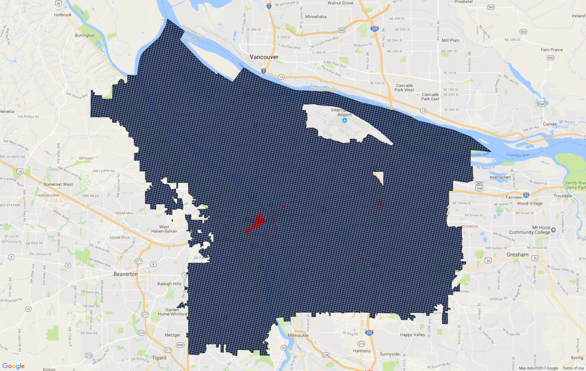

% Michael Chirico

## Teaching

* Statistics for Economists (Spring 2017) [[Course Page](http://ditraglia.com/Econ103Public/)] [[Course GitHub](https://github.com/fditraglia/Econ103Public)]

* [Statistical Analysis for Political Science (Fall 2016)](upenn/psci692/course_page.html)

* [Intermediate Microeconomics (Summer 2016)](xian/micro/course_page.html)

* [Intermediate Macroeconomics (Summer 2016)](xian/macro/course_page.html)

## [R Workshop](iesrtutorial.html)

## R Packages

* [`funchir`](https://github.com/MichaelChirico/funchir): convenience functions. On CRAN [here](https://cran.r-project.org/web/packages/funchir/index.html).

* [`texr`](https://github.com/MichaelChirico/texr): simple, robust interface for converting R objects into TeX tables, etc. Very early-stage.

## Miscellany

* [`portland`](https://github.com/MichaelChirico/portland): Code associated with Team Kernel Glitch's submission to the [NIJ Real-Time Forecasting Challenge](https://www.nij.gov/funding/Pages/fy16-crime-forecasting-challenge.aspx), evaluation of which is ongoing.

* [Distribution of Initials](http://i.imgur.com/FbOqTcF.png): Derived from the roughly 85 million observations in the [Social Security Death Master File](http://ssdmf.info/), a simple two-way table-as-heat-map showing the most- and least-common initials in the United States. There's also this [interactive `shiny` applet](https://michaelchirico.shinyapps.io/social_security_names/) which displays the top 10 initial pairs in each year. Code using `data.table`, `iotools`, `RColorBrewer`, `funchir`, and `shiny` found [here](https://github.com/MichaelChirico/assorted_code/tree/master/social_security_names); also includes some reduced-size .csv files containing aggregated counts.

* [All-Time MLB Home Run Leaders](https://michaelchirico.shinyapps.io/home_runs/): I made a `shiny` app which depicts, for a chosen year, the make-up of the top-ten list in the MLB for all-time home runs, and the trajectory of how each player's HR count evolved over the course of their career. The code for this is [here](https://github.com/MichaelChirico/assorted_code/tree/master/home_runs).

* [Competitiveness of Major Sports Leagues](http://imgur.com/dy8ym3Y): Using the Gini coefficient on win percentages within a season (recorded from a web scraping exercise) to quantify the evolution over time of the competitiveness of each of the four major sports leagues in the USA -- NFL, MLB, NBA, and NHL. Code [here](https://github.com/MichaelChirico/assorted_code/blob/master/sports_gini.R).

* [Citation Signature Plot of Economics Journals](http://imgur.com/uHTa4sG): As suggested by [Frank Diebold](http://fxdiebold.blogspot.com/2016/09/inane-journal-impact-factors.html), an alternative to the standard journal impact factor is to compare the rank-order statistics of the most cited articles in each journal; by this metric, too, the usual suspects emerge as most reputable. Code for scraping and plot [here](https://github.com/MichaelChirico/assorted_code/blob/master/econ_journal_csp.R).

* [Admittance of Iraqi Refugees to the US](http://imgur.com/YyW97yZ): Scraping data from the US Department of State website, plot the number of refugees from Iraq admitted to the US each month since October, 2007. Add to this a three-month moving average, and a shading surrounding the stated period of "re-vetting" following the discovery of a shortcoming in this process _circa_ May, 2011.

_you can check out the rest of my analysis portfolio at my [GitHub Page](https://github.com/MichaelChirico)_
